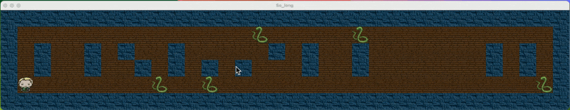

# SoLong

## Projet

Being a developer is a great thing for creating your own game.
But a good game needs some good assets. In order to create 2D games, you will have to search for tiles, tilesets, sprites, and sprite sheets.
Fortunately, some talented artists are willing to share their works on platforms like:
itch.io
In any case, try to respect other people’s work.

## Gameplay Preview

## Library

The game uses the [MLX library](https://github.com/42Paris/minilibx-linux) for rendering graphics.

## License

MIT License
Copyright (c) 2024 Jérémy Lorette